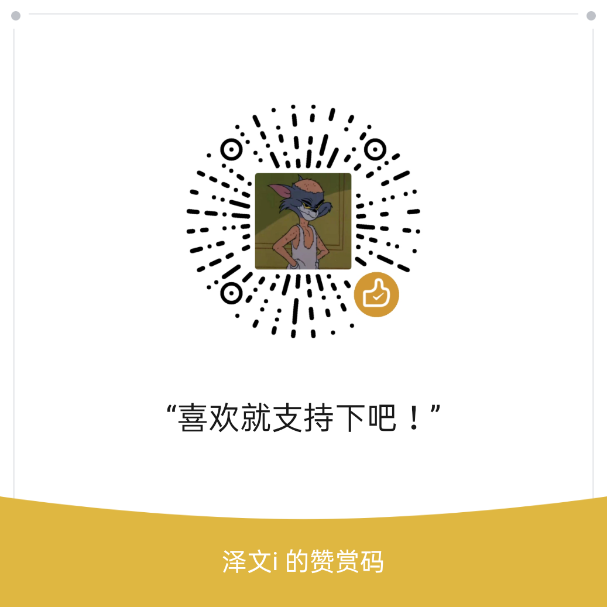

## 基本概述

 [ <u>**从gitee下载8051-ELL**</u>](https://gitee.com/zeweni/ELL-8051-LIB)  

    <a href='https://gitee.com/zeweni/ELL-8051-LIB/stargazers'></img></a> <a href='https://gitee.com/zeweni/ELL-8051-LIB/members'></img></a>

> 8051-ELL库，是根据新一代增强型8051为内核的MCU，基于keil开发的软件包。函数库采用了LL库的编程思想，充分考虑8051的特性，结合硬件条件，提供大量标准的API函数，供开发者访问底层硬件细节。并且函数库的大小可裁剪，在代码密度和执行效率上做了很好的平衡。

> ELL是`efficient low-layer`的缩写，意思是`高效低封装`，结合了`HAL库`和`LL库`的编程思想，既保证了通用性又降低了flash的过度占用。可谓是一举两得，高效、简洁、好用！

> 8051-ELL库支持Keil4和Keil5，支持Vscode协同开发，推荐使用EIDE插件。目前ELL库主要适配了STC公司的单片机型号，以STC8系列为主。后续计划增加STC12、STC15、STC16系列。

> 函数库遵循`Apache 许可证 2.0`版本，可免费在商业产品中使用，不需要公布应用程序源码，没有潜在商业风险。

## 优秀特性

* 模块可裁剪，耦合性极低
* 占用的ROM小
* 支持STC8系列MCU，硬件仿真
* 支持STC8系列MCU，代码配置时钟
* 提供组件化服务
* 代码规范，中英文注释，易于阅读
* 稳定性高，已经过产品验证
* 兼容RTOS

## 支持的型号

> ELL库率先支持了STC8系列MCU，部分型号可能有所差异，详情可查看官方数据手册。

> `√`代表已经支持、`空`代表MCU没有这个外设、 ` X`代表还没有适配

| 型号      | TIMER | IO   | ISR | SYSCLK | PCA  | PWM  | MPWM | HPWM | EEPROM | ADC  | MDU16 | COMP | USB  | LED  |
| --------- | ------ | ---- | ---- | -------- | ---- | ---- | ---- | ---- | ------ | ---- | ----- | ------ | ---- | ---- |
| STC8A系列 | √      | √    | √    | √        | √    | √    | X    | X    | √      | √    |       | √      |      |      |
| STC8C系列 | √      | √    | √    | √        |      |      |      |      | √      |      | √     | √      |      |      |
| STC8F系列 | √      | √    | √    | √        |      |      |      |      | √      |      |       | √      |      |      |
| STC8G系列 | √      | √    | √    | √        | √    |      | X    |      | √      | √    | √     | √      | X    | X    |
| STC8H系列 | √      | √    | √    | √        |      |      |      | X    | √      | √    | √     | √      | X    | X    |

## 赞助支持

 

- 如果你觉得ELL库对你有所帮助，可以请我喝一杯咖啡！

- 你的赞助，将激励我加快ELL库的开发进度！

>  

 

* 如果遇到技术问题，你可以加群获取帮助，在这里可以帮你解决关于ELL库90%的问题。

* 微信群可以在QQ群获得。

>  

