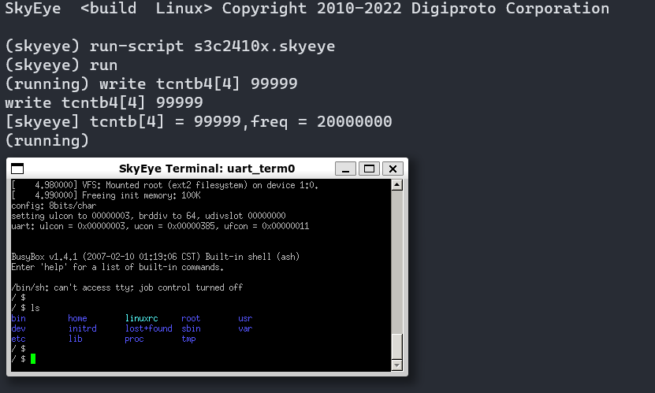

# 基于SkyEye仿真运行s3c2410x

## 一、处理器介绍

S3C6410是三星公司于2007年推出的一款经典的基于ARM11架构的高性能芯片。该芯片拥有丰富的片上外设，广泛应用于图像处理或视频处理等领域，能够给用户提供更丰富的多媒体视觉体验。凭借其突破性的3D图形处理能力和超高性价比，S3C6410芯片成为了手持设备（例如便携式自动导航系统PND）的不错选择。

## 二、SkyEye工程创建

### （一）新建仿真工程

启动Open-SkyEye的容器，进入bash，在命令行新建文件夹，以s3c2410x为例：

```
mkdir -p s3c2410x/binary s3c2410x/source && cd s3c2410x
```

按照如下目录，创建对应的文件

```
├─s3c2410x           # 仿真工程
   ├─binary          # 二进制文件夹
   |  ├─...                  
   ├─source          # 源代码文件夹
   |  ├─...  
   ├─s3c2410x.json   # 模型文件
   ├─s3c2410x.py     # 自动化脚本
   └─s3c2410x.skyeye # 启动文件
```

SkyEye工程加载与运行最基本需要3个文件，分别为二进制文件，虚拟目标系统构建文件(.json)以及启动脚本文件(.skyeye)。

1. binary中导入需要加载的二进制文件。
2. source导入的是需要查看及源码覆盖统计的源码目录。
3. json文件为虚拟目标系统构建文件
4. skyeye为启动文件（SkyEye项目支持一个工程配置多个启动脚本文件。默认启动脚本文件是新建工程时自动创建的与工程同名的skyeye文件）

### （二）导入二进制

编译基于s3c2410x的linux（方法可自行查阅），生成vmlinux和initrd.img镜像文件，将其拷贝到s3c2410x/binary下面。

### （三）基于json搭建虚拟目标

使用json格式文件来搭建虚拟目标系统，可以查阅s3c2410x的芯片手册，了解它有哪些片内外设，然后按照添加对应元件来完成搭建，下面给出示例：

```
├─s3c2410x1           # 单板
   ├─arm920t_core     # 处理器核心       
   ├─memory_space     # 内存空间
   ├─s3c2410x_vic     # vic外设
   ├─s3c2410x_uart    # uart外设
   ├─uart_term        # uart输出终端
   ├─s3c2410x_gpio    # gpio外设
   ├─s3c2410x_sysctrl # sysctrl外设
   ├─s3c2410x_timer   # timer外设
   ├─ram              # ram内存
   └─image            # ram的image空间
```

1. 首先需要一块板卡(s3c2410x1),用来在上面放置其他元件。
2. 在板卡上放置核心(arm920t_core),并设置性load_mask为0xFFFFFF，load_addr为0x30000000，将arm920t_core连接到memory_space接口，如下示例。

```json
{
    "s3c2410x1_0":{
        "base":"mach",
        "class":"s3c2410x1",
        "s3c2410x1_core_0":{
            "base":"cpu",
            "class":"arm920t_core",
            "load_mask":["uinteger", "0xFFFFFF"],
            "load_addr":["uinteger", "0x30000000"],
            "memory_space":["iface", "memory_space_0"]
        }
}
```

3. 继续进行memory_space元件连接
   - 连接到ram，设置起始地址为0x30000000，长度为0x02000000；
   - 连接到s3c2410x_vic，设置起始地址为0x4A000000，长度为0x100；
   - 连接到s3c2410x_sysctrl，设置起始地址为0x4c000000，长度为0x18；
   - 连接到s3c2410x_uart，设置起始地址为0x50000000，长度为0x4000；
   - 连接到s3c2410x_timer，设置起始地址为0x51000000，长度为0x44；
   - 连接到s3c2410x_gpio，设置起始地址为0x56000000，长度为0xc0；

memory_space的配置如下图所示。

```json
{
    "memory_space_0":{
            "base":"device",
            "class":"memory_space",
            "memory_space":[
                [1,"iface", "ram0", "0x30000000", "0x02000000"],
                [2,"iface", "vic", "0x4A000000", "0x100"],
                [3,"iface", "core_0_uart_0", "0x50000000", "0x4000"],
                [4,"iface", "gpio0", "0x56000000", "0xc0"],
                [5,"iface", "sysctrl0", "0x4c000000", "0x18"],
                [6,"iface", "timer4", "0x51000000", "0x44"]
            ]
        }
}
```

4. 进行其他元件连接：
   - ram连接到image，image设置size为0x02000000；
   - s3c2410x_vic连接到arm920t_core_0的core_signal_intf接口
   - s3c2410x_uart连接到uart_term_0的skyeye_uart_intf接口，并连接到s3c2410x_vic的general_signal_intf接口。
   - s3c2410x_timer连接到s3c2410x_vic的general_signal_intf接口，设置属性int_number为14；
5. 其他未向外连接的元件json书写格式如下图

```json
"image0": {
    "base": "device",
    "class": "image",
    "size": ["uinteger", "0x02000000"]
},
"ram0": {
    "base": "device",
    "class": "ram",
    "memory_space": ["iface", "image0"]
},
"vic": {
    "base": "device",
    "class": "s3c2410x_vic",
    "core_signal_intf":["iface", "s3c2410x1_core_0"]
},
"core_0_uart_0": {
    "base": "device",
    "class": "s3c2410x_uart",
    "rfifo": ["uinteger", "256"],
    "skyeye_uart_intf":["iface", "uart_term0"],
    "general_signal_intf":["iface", "vic"]
},
"uart_term0": {
    "base": "device",
    "class": "uart_term"
},
"gpio0": {
    "base": "device",
    "class": "s3c2410x_gpio"
},
"sysctrl0": {
    "base": "device",
    "class": "s3c2410x_sysctrl"
},
"timer4": {
    "base": "device",
    "class": "s3c2410x_timer",
    "general_signal_intf": ["iface", "vic"],
    "int_number": ["uinteger", "14"]
}
```

以上为s3c2410x测试用例中json文件编写方法，json文件描述了整个虚拟目标系统的构成，cpu与外设间的连接、属性设置和设备与设备间的连接关系，最后贴出一份完整的json搭建仿真模型的代码：

```json
{
    "s3c2410x1_0":{
        "base":"mach",
        "class":"s3c2410x1",
        "s3c2410x1_core_0":{
            "base":"cpu",
            "class":"arm920t_core",
            "load_mask":["uinteger", "0xFFFFFF"],
            "load_addr":["uinteger", "0x30000000"],
            "memory_space":["iface", "memory_space_0"]
        },
        "memory_space_0":{
            "base":"device",
            "class":"memory_space",
            "memory_space":[
                [1,"iface", "ram0", "0x30000000", "0x02000000"],
                [2,"iface", "vic", "0x4A000000", "0x100"],
                [3,"iface", "core_0_uart_0", "0x50000000", "0x4000"],
                [4,"iface", "gpio0", "0x56000000", "0xc0"],
                [5,"iface", "sysctrl0", "0x4c000000", "0x18"],
                [6,"iface", "timer4", "0x51000000", "0x44"]
            ]
        },
        "image0": {
            "base": "device",
            "class": "image",
            "size": ["uinteger", "0x02000000"]
        },
        "ram0": {
            "base": "device",
            "class": "ram",
            "memory_space": ["iface", "image0"]
        },
        "vic": {
            "base": "device",
            "class": "s3c2410x_vic",
            "core_signal_intf":["iface", "s3c2410x1_core_0"]
        },
        "core_0_uart_0": {
            "base": "device",
            "class": "s3c2410x_uart",
            "rfifo": ["uinteger", "256"],
            "skyeye_uart_intf":["iface", "uart_term0"],
            "general_signal_intf":["iface", "vic"]
        },
        "uart_term0": {
            "base": "device",
            "class": "uart_term"
        },
        "gpio0": {
            "base": "device",
            "class": "s3c2410x_gpio"
        },
        "sysctrl0": {
            "base": "device",
            "class": "s3c2410x_sysctrl"
        },
        "timer4": {
            "base": "device",
            "class": "s3c2410x_timer",
            "general_signal_intf": ["iface", "vic"],
            "int_number": ["uinteger", "14"]
        }
    }
}

```

## 三、SkyEye工程运行

Open-SkyEye的启动脚本编写与上述过程相同,skyeye脚步文件编辑如下：

```
define-conf skyeye.json                             # 声明json文件
load-binary s3c2410x1_core_0 vmlinux                # 加载二进制文件
load-file  s3c2410x1_core_0 initrd.img 0x30800000   # 加载镜像，指定内存地址
init-ok                                             # 初始化完毕
```

进入s3c2410x.skyeye所在目录，然后启动Open-SkyEye，输入命令`run-script s3c2410x.skyeye`和`run`运行。

输出结果如下图所示：


