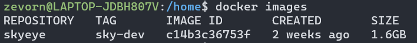
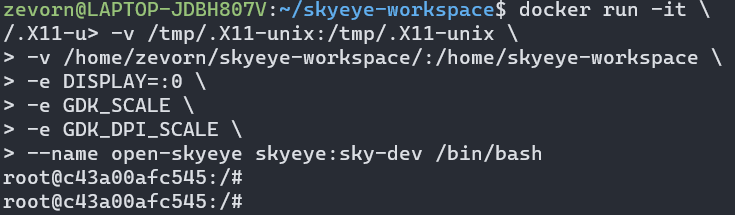

# 
# 前言

Open-SkyEye是一款可建模的国产嵌入式仿真软件，拥有良好的开源基因，虽然经历过商业孵化，但经历过一定的发展之后，我们还是决定，将我们的许多重要成果，继续回馈和贡献给开源社区。Open-SkyEye最早在linux上面开发，为了保持优良的传统，Open-SkyEye的发行方式，还是以linux为主，不过考虑使用windows和macos的小伙伴，Open-SkyEye会提供Docker镜像，并在里面打包好了开发和运行环境，可以很方便的在各种支持docker的操作系统平台部署和运行，能够快速的上手和体验Open-SkyEye。

本章节，主要从Open-SkyEye的安装、运行、常用命令等方面入手，并通过一个简单的例子，带领大家快速熟悉和掌握Open-SkyEye，能够应用到日常学习、开发当中。

****

# 快速安装

## 一、准备工作

Open-SkyEye的发行版，基于Docker打包，只需要安装docker，就能正常使用和开发Open-SkyEye。目前我们测试过ubuntu、archlinux、windows、macos，只要支持docker的生产环境，基本都可以运行Open-SkyEye。

除了安装Docker和下载镜像，你还需要clone或者下载一些代码（Open-SkyEye源代码和测试用例）。链接清单如下：

[Docker开发镜像](https://pan.baidu.com/s/1BCjX7FmBQxDxf_eBSuPpSw)（提取码：skye）

[Open-SkyEye源代码](https://gitee.com/open-skyeye/code) (或 git clone https://gitee.com/open-skyeye/code.git)

[Open-SkyEye测试用例](https://gitee.com/open-skyeye/testcase) (或 git clone https://gitee.com/open-skyeye/testcase.git)

如果你下载镜像的速度较慢，可以加我们的QQ社区群聊「238612183」，在群文件获取。

Docker安装教程比较简单，这里不再过多赘述，可以根据自己的环境，在网上查阅资料以后安装。

为了方便开发和调试，在下载好源代码和测试用例以后，请建立一个文件夹，将它们包含进去，这个文件夹，将被共享给容器使用。

```
mkdir /home/zevorn/skyeye-workspace
cd /home/zevorn/skyeye-workspace
git clone https://gitee.com/open-skyeye/code.git
git clone https://gitee.com/open-skyeye/testcase.git
```
## 二、导入镜像，并新建容器。

以ubuntu20.04为例，在进入镜像所在目录以后，请使用如下命令导入镜像：

`docker load < open-skyeye-developer-docker.tar`

这个时候可以使用`docker images`命令，查看镜像列表，看看是否导入成功。



现在，我们基于这个镜像，新建一个容器，这个命令有些复杂，先贴出来再解释：
```
docker run -it \
-v /tmp/.X11-unix:/tmp/.X11-unix \
-v /home/zevorn/skyeye-workspace/:/home/skyeye-workspace \
-e DISPLAY=:0 \
-e GDK_SCALE \
-e GDK_DPI_SCALE \
--name open-skyeye skyeye:sky-dev /bin/bash
```
首先，`run`是创建容器的基本命令，`-v  /tmp/.X11-unix:/tmp/.X11-unix`、`-e DISPLAY=:0 -e GDK_SCALE -e GDK_DPI_SCALE`是将宿主机的显示能力共享给容器， `-v /home/zevorn/skyeye-workspace/:/home/skyeye-workspace`是将一个文件夹共享给容器，open-skyeye的源代码和测试用例都放在这个文件夹下。 `--name open-skyeye skyeye:sky-dev`是给容器命名，后面跟着的是镜像名称，`/bin/bash`是以bash启动。更多关于Docker的使用方法和命令，后续由其他章节来描述。

其中共享主机的显示能力不是必须的，如果你不使用Open-SkyEye的UI和串口交互软件putty。单纯创建一个没有显示能力的容器命令如下：
```
docker run -it \
-v /home/zevorn/skyeye_workspace/:/home/skyeye_workspace \
--name open-skyeye skyeye:sky-dev /bin/bash
```

创建好容器，就进入了bash，效果如下图：




****
# 命令行cli的使用

正在更新。


****

# 图形界面ui的使用
正在更新。


****

# 工程建模
正在更新。


